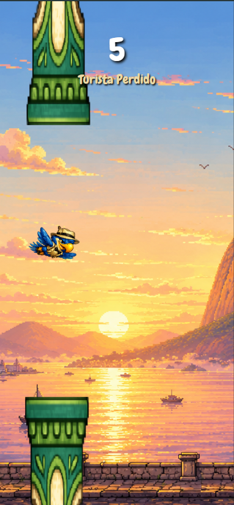
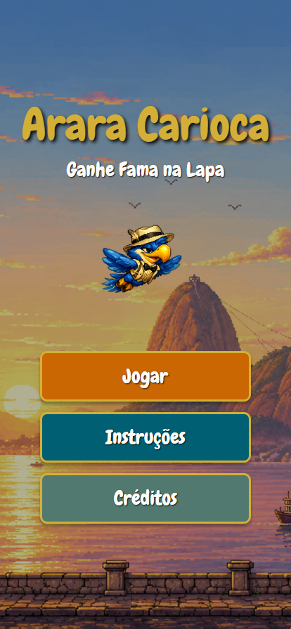

# Arara Carioca 🦜

Bem-vindo ao repositório do **Arara Carioca**, um jogo divertido e interativo desenvolvido em React Native com a plataforma Expo. O jogo desafia o jogador a controlar uma arara simpática, desviar dos pilares pelo caminho e tentar alcançar a pontuação máxima!

## 🌐 Jogue Online

Experimente o **Arara Carioca** sem precisar clonar ou compilar o projeto:

| Plataforma | Acesso | Descrição |
| :--- | :--- | :--- |
| 🌐 **Navegador Web** | [**Jogar no Navegador**](https://arara-carioca.expo.app) | Versão web estática hospedada via EAS Hosting, compatível com navegadores desktop e mobile. |
| 📱 **Android (APK)** | [**Baixar APK Preview**](https://expo.dev/artifacts/eas/arara-carioca-preview.apk) | Build de preview gerada via EAS Build para instalação direta em smartphones Android. |

### 📲 Instruções para instalação do APK (Android)
1. Faça o download do arquivo `.apk` diretamente pelo link acima no seu smartphone.
2. Ao concluir o download, abra o arquivo baixado.
3. Caso o Android solicite permissão, autorize a **instalação de apps de fontes desconhecidas** para o seu navegador ou gerenciador de arquivos.
4. Conclua a instalação e divirta-se jogando!

## 🎮 Sobre o Jogo

O **Arara Carioca** traz mecânicas inspiradas nos clássicos jogos arcade, mas com um toque especial e progressivo!
- **Fundos Dinâmicos**: O cenário de fundo evolui de acordo com a sua pontuação, criando um ambiente cada vez mais imersivo.
- **Trilha Sonora Dinâmica**: Trilhas sonoras envolventes que se alternam conforme o estado do jogo (Menu, Gameplay, Game Over e Vitória).
- **Condição de Vitória**: Demonstre sua habilidade alcançando **50 pontos** para destravar a tela de vitória!

## 📸 Telas do Jogo

Confira como o jogo se parece:

<div align="center">
  
  
  
</div>

## 🛠️ Tecnologias Utilizadas

- **[React Native](https://reactnative.dev/)** & **[Expo](https://expo.dev/)**
- **TypeScript** para maior segurança no código
- **React Navigation** para a transição suave entre as telas
- **Expo AV** para o controle e reprodução da trilha sonora e efeitos
- **React Native Reanimated** para animações fluidas de movimentação

## 🚀 Como Executar Localmente

Siga as instruções abaixo para rodar o projeto na sua máquina:

1. **Clone o repositório** (caso esteja utilizando Git):
   ```bash
   git clone https://github.com/seu-usuario/arara-carioca.git
   ```

2. **Acesse a pasta do projeto**:
   ```bash
   cd atv_05_arara_carioca
   ```

3. **Instale as dependências**:
   ```bash
   npm install
   ```

4. **Inicie o servidor do Expo**:
   ```bash
   npm start
   ```

5. **Jogue!**
   Abra o aplicativo **Expo Go** no seu celular (Android ou iOS) e escaneie o código QR exibido no terminal, ou pressione `w` para testar no navegador.

---
*Projeto desenvolvido para a disciplina de Desenvolvimento Mobile (React Native) na Fatec.*
